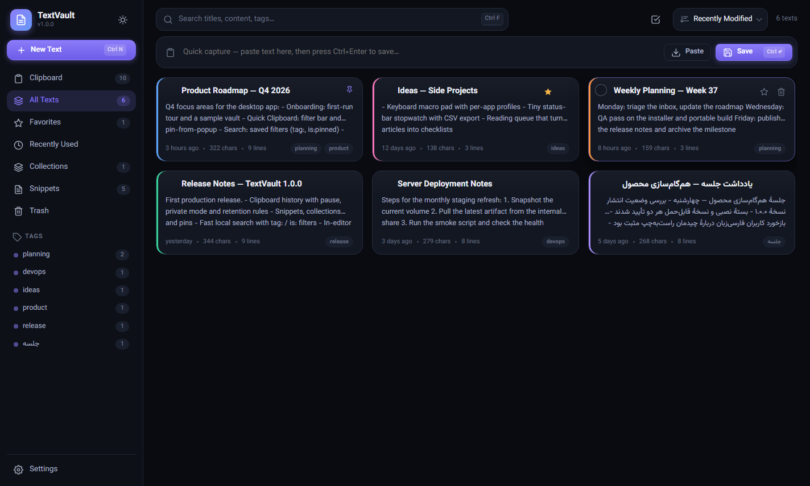

# TextVault

A modern, privacy-first desktop **clipboard manager and text workspace** for Windows: TextVault watches your clipboard, saves everything locally, and makes every piece of text instantly searchable, organiz­able and exportable — with **first-class Persian + English mixed (bidirectional) text support**.

Stop scattering `text.txt` files over your desktop: open TextVault, paste, save. Later, search, view, edit, copy, star, tag and export to **TXT / Word (.docx) / PDF**.



---

## Download — v1.0.0

Get it from [GitHub Releases](https://github.com/psychogdz/TextVault/releases/tag/v1.0.0):

| Package | File |
|---|---|
| **Installer** | `TextVault-1.0.0-Setup.exe` — per-user install (no administrator required), Start Menu shortcut, clean uninstall |
| **Portable** | `TextVault-1.0.0-Portable.zip` — extract anywhere and double-click `TextVault.exe` |

Both are self-contained Windows builds with the Electron runtime bundled — no Node.js, no terminal.

**Requirements:** Windows 10 or 11 (64-bit). To run from source you need [Node.js](https://nodejs.org) 18+ (22 LTS verified).

---

## Highlights

| Area | What you get |
|---|---|
| **Clipboard history** | Automatic local capture of everything you copy (300 ms change detection), with duplicate handling (re-copy moves the item to the top), pinned/favorite protection and configurable history size + time retention. |
| **Quick Clipboard** | A frameless, always-on-top launcher (default `Ctrl+Shift+V`, configurable) with instant search — copy any recent item without opening the main window. `Esc` hides it. |
| **Privacy** | Pause/resume monitoring (tray + UI), session-scoped **Private mode**, sensitive-content flagging (passwords/keys/tokens are masked until you reveal them) with an optional never-save rule, time-based retention that never deletes pinned/favorite items. Closing the window can keep monitoring running in the tray. |
| **Snippets & Collections** | Save reusable texts on purpose (commands, templates, replies) and group clipboard items and snippets into named collections. |
| **Command palette** | `Ctrl+K` opens a searchable, keyboard-driven command palette on a central command registry. |
| **English + فارسی** | The interface itself is bilingual (English/RTL Persian) with translated chrome and tray; mixed bidi content stays correct everywhere. |
| **Text tools** | 16 local transformations (case, sort/unique lines, JSON format/minify, Base64, URL encode/decode) applied in the editor — always undoable, never persisted until you save. |
| **Quick capture** | Paste into the dashboard bar → `Ctrl+Enter` → saved. Or `+ New Text` for the full editor. |
| **Selection Mode** | Click the ☑ button, press `Ctrl+M`, or click a card's circle badge to enter a dedicated multi-select state: **clicking anywhere on a card toggles its selection** (accent ring + filled circle badge — the editor never opens), with a clear toolbar showing `N selected`, plus **Select All / Clear Selection / Cancel**. `Ctrl+A` selects all, `Esc` cancels, `Delete` deletes the selection (with confirmation) and the toast offers **Undo**. |
| **Card actions** | Hover a card for **⭐ Star** and **🗑 Trash** side-by-side at its top-right. Star toggles favorite only; Trash asks “Delete this text?” (Cancel / **Move to Trash**) and never opens the text — with an **Undo** toast right after. |
| **Card color labels** | Give any text a color (Red / Orange / Yellow / Green / Blue / Purple / Pink) from the 🎨 droplet button in the editor — the card shows a colored stripe on its left edge for quick visual grouping. |
| **Editor tags** | Type new tags, or click the **tag button** next to the tag field to pick from **all existing tags** (with usage counts) — one click adds the exact tag. |
| **Persian + English** | Per-paragraph automatic direction detection (`unicode-bidi: plaintext`), Auto/RTL/LTR override per text, correct display of numbers, URLs, code, symbols, emojis inside RTL text — in the editor, cards, previews, search results, and exported files. |
| **Search** | Instant title/tag search plus full-content search with highlighted snippets, across hundreds/thousands of texts. Supports `tag:`, `is:fav`, `is:pinned` on texts and `type:`, `collection:` filters on clipboard & snippets. |
| **Editor** | Undo/redo, cut/copy/paste, select-all, find & replace (with match count and case toggle), word-wrap and font toggles, live char/word/line/Ln,Col stats. |
| **Organize** | Tags with sidebar filtering, favorites (⭐ pinned to top), 6 sort orders, multi-select with bulk export/delete/favorite. |
| **Safety** | Debounced auto-save, crash-safe drafts (restored on next launch), Trash with restore/empty, duplicate detection ("this text already exists"), save-before-quit flush. |
| **Export** | Single text → TXT / Word / PDF from the editor or a 1-card selection. Multiple texts → **“One combined file”** or **“Separate file for each text”**, each in TXT / DOCX / PDF. TXT is byte-exact UTF-8; DOCX uses proper `w:bidi`/`w:rtl` paragraph properties; PDF is printed by Chromium with the embedded Vazirmatn font (perfect Arabic shaping & bidi, multi-page). |
| **Backup** | Export/Import the whole library (including Trash) as JSON — merge or replace, Unicode-safe. |
| **Design** | Dark/Light/System themes, 5 accent colors, Vazirmatn typography, virtualized card grid (thousands of entries, bounded DOM), skeleton loading, empty states, toasts, smooth transitions. |

---

## Running the app

### Recommended (no Node.js, no terminal) — the packaged app

The end user never needs Node.js, npm or a command prompt:

- **Installer:** run `TextVault-1.0.0-Setup.exe`, install (no admin needed), launch from the Start Menu.
- **Portable:** extract `TextVault-1.0.0-Portable.zip` (or copy the folder) and double-click **`TextVault.exe`**.

Both are normal desktop apps with their own window and icon.

### On this machine, from the project folder

- **Everyday:** double-click **`TextVault.vbs`** — starts TextVault with **no console window at all**. The app runs as an independent process: closing/killing any launcher or terminal never terminates it. (Prefers the packaged `dist\TextVault\TextVault.exe` if present; otherwise runs the dev copy, installing dependencies silently on first run.)
- **Setup / development:** `start.bat` — same launch, but keeps a visible console (useful for first-time dependency installation and watching logs).

### From source (any machine with Node.js 18+)

```bash
npm install        # downloads Electron + docx (~1–2 minutes, once)
npm start          # launches TextVault
```

### Tests
```bash
npm test           # syntax + unit (71) + IPC/architecture boundary checks (32)
npm run test:e2e   # 155 end-to-end checks against the real running app
```

The e2e suite drives the real app end to end: text/snippet/clipboard CRUD, the clipboard engine (capture, duplicate handling, pause, private mode, sensitive auto-skip, retention), close-to-tray with monitoring while hidden, Quick Clipboard + global shortcut, unified search (English + Persian) with measured p95 over a 10k-entry dataset, exports (TXT byte-exact, DOCX/PDF, combined/separate), versioned backup round-trips across all four stores, i18n (EN/FA RTL), accessibility invariants (landmarks, keyboard-operable cards/dialogs/switches, focus management), restart persistence, and boot/memory/performance gates. Screenshots land in `test-output/`.

---

## Where your data lives

Everything is stored **locally** in an IndexedDB database inside the app's user-data folder (no cloud, no network):

```
%APPDATA%\TextVault\
```

(Settings → *Your Library* → **Data location** shows the exact path and can open the folder.)

IndexedDB is Chromium's embedded, transactional database — it handles thousands of entries without loading them all into the UI (the card grid is virtualized; each record keeps only derived metadata like preview/stats in memory).

---

## Backup & restore

- **Export Library** (Settings, or File menu): writes `TextVault_Backup_<date>.json` containing every entry (including Trash) with full Unicode fidelity.
- **Import Library**: pick a backup, then choose **Merge** (keeps current texts, adds the backup, skips exact duplicates) or **Replace** (restores the backup as the whole library).

---

## How selecting & exporting works

**Selection Mode** — click the ☑ button in the top bar (or a card's checkbox):

- An accent-tinted toolbar appears: *Selection Mode · N selected · Select All · Clear Selection · Cancel*
- Clicking **anywhere on a card** toggles it — selected cards get an accent border, tinted background and check badge
- Clicking a card **never opens the editor** while in this mode
- Star/Trash on cards keep working normally and never select a card
- `Ctrl+A` select all · `Esc` cancel · `Delete` move the selection to Trash (with confirmation)
- The floating action bar offers **Export / Favorite / Delete** for the selection; entering Selection Mode always starts fresh

**Export** — from the editor toolbar (`Ctrl+E`), a card selection, or the action bar:

- **1 text:** *TXT — exact original text* · *Word document (.docx)* · *PDF document*
- **2+ texts:** two clearly labelled groups —
  - *One combined file:* Combined TXT / Combined Word / Combined PDF
  - *Separate file for each text:* Separate TXT / Word / PDF files (you pick a folder; name collisions are auto-deduped `name-1`, `name-2`…)
- Sensible filenames come from each text's title (Windows-unsafe characters sanitized)

## Keyboard shortcuts

| Action | Shortcut |
|---|---|
| New text | `Ctrl + N` |
| Save now | `Ctrl + S` |
| Search (dashboard) / Find (editor) | `Ctrl + F` |
| Find & Replace | `Ctrl + H` |
| Export menu | `Ctrl + E` |
| Copy all text | `Ctrl + Shift + C` |
| Undo / Redo | `Ctrl + Z` / `Ctrl + Shift + Z` |
| Toggle theme | `Ctrl + Alt + T` |
| Quick-capture save | `Ctrl + Enter` |
| Toggle selection mode | `Ctrl + M` |
| Selection mode: select all | `Ctrl + A` |
| Delete selected cards | `Delete` |
| Leave selection mode / close panel | `Esc` |

---

## How Persian/English mixed text is handled

This is the core design constraint of TextVault, and it is solved at the engine level rather than with string manipulation:

1. **UI (editor, cards, previews, search snippets):** the whole interface runs on Chromium's Unicode implementation. Text blocks use `unicode-bidi: plaintext`, so **each paragraph's base direction is decided by its own first strong character** — a Persian paragraph lays out RTL, an English paragraph LTR, and mixed lines order correctly by the Unicode Bidirectional Algorithm. No forced document-wide direction, no reversed text.
2. **Direction override:** every text has an Auto/RTL/LTR setting (`Auto` re-resolves as you type based on the first strong character).
3. **Word export:** paragraphs detected RTL-dominant get `w:bidi` (paragraph) + `w:rtl` (run) properties and a complex-script font, so Word renders them right-to-left exactly as the app showed them; LTR paragraphs stay plain.
4. **PDF export:** the PDF is printed by Chromium itself (`printToPDF`) from a styled document with the same `unicode-bidi: plaintext` rules and the embedded **Vazirmatn** font — Arabic shaping and bidi are pixel-identical to the app.
5. **TXT / JSON backups:** content is stored and written as exact UTF-8 (verified byte-for-byte in tests).

Fonts: [Vazirmatn](https://github.com/rastikerdar/vazirmatn) (bundled, `src/assets/fonts/`) for beautiful Persian+Latin typography.

---

## Architecture

```
TextVault.vbs              everyday launcher (no console; prefers packaged exe)
start.bat                  setup/dev launcher (visible console)
installer.iss              Inno Setup installer script (version from package.json)
release/                   official distributions (portable + setup), built by `npm run release`
electron/                  Main process
  main.js                  composition root (window, protocol, services wiring)
  preload.js               contextBridge API (window.tv) — contextIsolation on, nodeIntegration off
  ipc/                     channel registry + boundary validation + handler registration
  services/                window, menu, app:// protocol, exports, file dialogs,
                           clipboard-service (monitor/pause/private/retention),
                           tray, quick-window (Quick Clipboard), i18n-main
  exporters/
    txt.js                 exact/combined TXT builder
    docx-builder.mjs       Word generation (docx lib, per-paragraph bidi detection)
    pdf-html.mjs           print-view HTML (plaintext bidi, embedded fonts, page breaks)

src/                       Renderer (ES modules, no framework, no build step)
  index.html               app shell (CSP: script/style/font from app: only)
  quick.html               Quick Clipboard launcher window
  styles/                  theme tokens (dark/light/accents), base, components, views
  js/
    app.js                 bootstrap: views, sidebar, shortcuts, menus, export flow
    state.js               App singleton: entries cache, settings, persistence, pub/sub
    commands.js            command palette registry
    quick.js               Quick Clipboard window logic
    core/                  db (IndexedDB), entry model, clipboard policy + persistence,
                           snippets domain, backup (v2 export/import)
    search/                query parser (tag:/is:/type:/collection:), scoring, snippets
    ui/                    icons, toasts/modals/dropdowns, virtual card grid
    views/                 dashboard, editor (Ctrl+F find & replace), clipboard,
                           snippets, collections, trash, settings

shared/                    13 pure modules used by BOTH processes (unit-tested):
                           bidi, stats, snippets, filename, query, i18n, validation,
                           clipboard-policy, sensitive, storage-migrations, backup-format,
                           detect, text-tools

test/
  syntax.cjs               renderer module syntax check
  unit.mjs                 71 unit tests (bidi, stats, policies, i18n, backup format, …)
  ipc-tests.mjs            32 IPC/architecture boundary checks
  e2e.js                   155 end-to-end checks against the real running app
  make-portable.cjs        portable build + smoke + zip
  make-release.cjs         installer build + install/uninstall verification
  upgrade-probe.cjs        upgrade-over-existing-install data probe
```

**Security model:** renderer runs with `contextIsolation: true`, `sandbox: true`, `nodeIntegration: false`; all file/dialog/clipboard operations go through typed IPC handlers; the CSP blocks all remote origins.

---

## Packaging & distribution

```bash
npm run release
```

builds **both official distributions** into `release/` and verifies them:

| Artifact | What it is |
|---|---|
| `release/TextVault-1.0.0-Portable/` (+ `.zip`) | Self-contained portable app — extract anywhere and double-click `TextVault.exe`. No admin rights, no Node.js, nothing else needed. |
| `release/TextVault-1.0.0-Setup.exe` | Windows installer ([Inno Setup](https://jrsoftware.org/isinfo.php) — chosen because the app ships as a ready-to-copy Electron folder; a mature installer system gives us Apps & Features registration, clean uninstall and shortcuts with no extra runtime). Per-user install (no administrator required), Start Menu shortcut, optional Desktop shortcut, custom install directory, app icon and version 1.0.0. |

The release pipeline (`test/make-portable.cjs` + `test/make-release.cjs` + `installer.iss`):
1. assembles the portable app from the exact Electron runtime the app was tested with (only the production dependency `docx` included),
2. smoke-tests the packaged `TextVault.exe`,
3. zips the portable build,
4. compiles the Inno Setup installer (version injected from `package.json` — single source of truth),
5. verifies the installer end-to-end: silent install → installed app boots → data stored in `%APPDATA%\TextVault` (never inside the install directory) → Start Menu shortcut created → silent uninstall removes everything.

Both distributions store user data in `%APPDATA%\TextVault\` (Electron userData), so switching between portable and installed versions keeps your library.

`TextVault.vbs` automatically prefers the packaged exe when one exists (release, then dist).

---

## License

MIT — bundles [Vazirmatn](https://github.com/rastikerdar/vazirmatn) (OFL).
